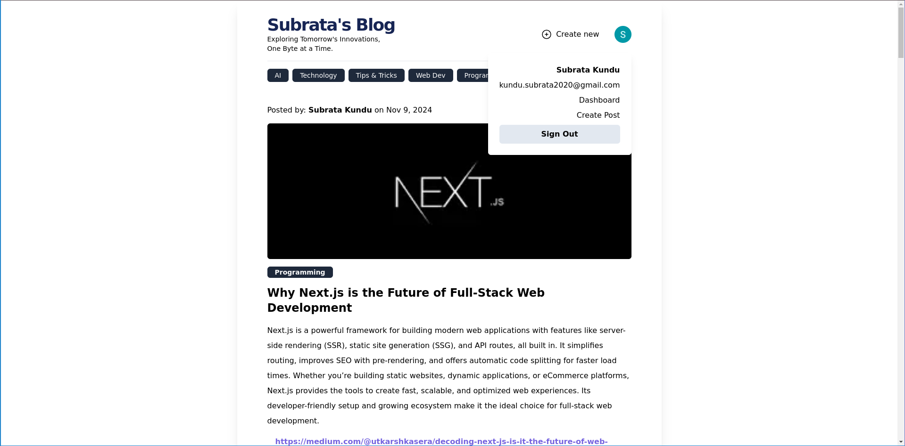

# Blog Application

This is a blog application built with **Next.js**, **TypeScript**, **React**, **Tailwind CSS**, **Prisma**, **MongoDB**, **Cloudinary**, and **NextAuth**. It allows users to create, read, and manage blog posts with secure authentication and image uploads.

## Features

- **User Authentication** with **NextAuth** (supports github, google providers).
- **Blog Post Management**: Create, Read, Edit, Delete and List blog posts.
- **Image Upload** using **Cloudinary**.
- **Responsive Design** powered by **Tailwind CSS**.
- **Backend API** using **Prisma** with **MongoDB** for data storage.

## Screenshots



## Prerequisites

Before you begin, ensure you have the following installed on your local machine:

- **Node.js** (v16 or later)
- **npm** (or **yarn** or **pnpm**)
- **MongoDB** (or a cloud instance like MongoDB Atlas)
- **Cloudinary Account** for image upload configuration

## Local Setup

1. Clone the Repository

	```bash
	git clone https://github.com/kundusubrata/blog-application.git
	cd blog-application
	```
2. Install Dependencies
	```bash
	pnpm install
	```
3.  Configure Environment Variables
	Create a `.env` file in the root of your project and add the necessary environment variables. Obtain the required values from the GitHub Developer Settings[https://github.com/settings/developers], Google Cloud Console[https://console.developers.google.com/apis/credentials], and Cloudinary upload[https://console.cloudinary.com/settings/c-83e3a396836394c5dbb29277cf4987/upload]. Replace the placeholders with your actual credentials for GitHub, Google, Cloudinary, and MongoDB.
	```bash
	GITHUB_CLIENT_ID=
	GITHUB_CLIENT_SECRET=
	GOOGLE_CLIENT_ID=
	GOOGLE_CLIENT_SECRET=
	NEXTAUTH_URL=http://localhost:3000
	NEXTAUTH_SECRET=MD23kjNvuj7WTIDYcM1T9kPB+uCChqj4ERN1Uu6pykKY=
	DATABASE_URL=""
	NEXT_PUBLIC_CLOUDINARY_CLOUD_NAME=""
	NEXT_PUBLIC_CLOUDINARY_UPLOAD_PRESET=""
	CLOUDINARY_API_KEY=
	CLOUDINARY_API_SECRET=
	```
4. Prisma Setup
	```bash
	npx prisma db pull
	npx prisma migrate dev --name model-added
	npx prisma generate
	npx prisma studio
	```
5. Run the Development Server
	```bash
	pnpm run dev
	```
	This will start the development server at `http://localhost:3000`.
6. Access the Application
	Open your browser and navigate to `http://localhost:3000` to see the blog application in action.

## Testing the Application

You can log in using the authentication provider you’ve configured (e.g., GitHub, Google, or custom credentials). Once logged in, you can create and view blog posts, and upload images to Cloudinary.

## Contributing

Feel free to fork this repository, create a branch, and submit pull requests for any improvements or fixes.
